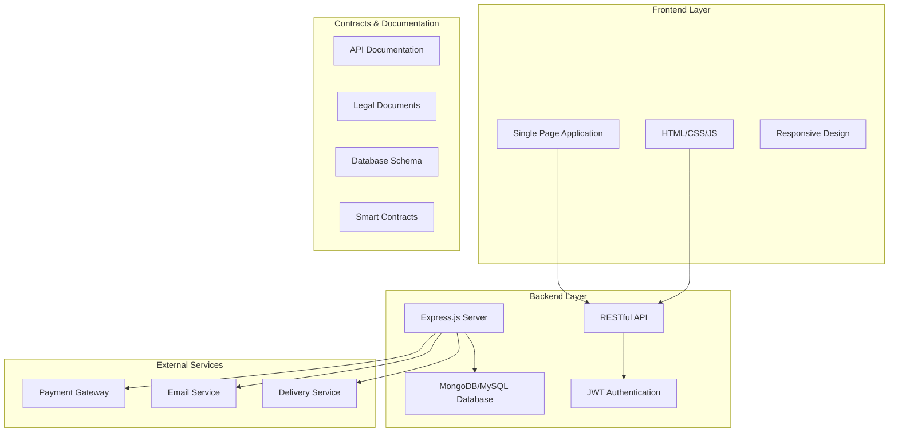

# Sugar Plum Bakery - System Architecture

## Overview

Sugar Plum Bakery is a full-stack e-commerce application for ordering and purchasing baked goods. The system consists of three main components: Frontend (client-side), Backend (server-side API), and Contracts (documentation and legal).

## Architecture Diagram



## Technology Stack

### Frontend
- **HTML5**: Semantic markup and structure
- **CSS3**: Responsive design with custom properties
- **Vanilla JavaScript**: DOM manipulation and API communication
- **Local Storage**: Client-side cart persistence

### Backend
- **Node.js**: Runtime environment
- **Express.js**: Web framework for API development
- **MongoDB/MySQL**: Database for data persistence
- **JWT**: Authentication and authorization
- **bcrypt**: Password hashing
- **Nodemailer**: Email communications

### Development Tools
- **Git**: Version control
- **npm/yarn**: Package management
- **Postman**: API testing
- **Swagger/OpenAPI**: API documentation

## Component Architecture

### Frontend Architecture

```
frontend/
├── index.html          # Main entry point
├── pages/             # Page components
│   ├── home.html      # Landing page
│   ├── menu.html      # Product catalog
│   └── cart.html      # Shopping cart
├── css/               # Stylesheets
│   ├── styles.css     # Global styles
│   ├── home.css       # Home page styles
│   ├── menu.css       # Menu page styles
│   └── cart.css       # Cart page styles
├── js/                # JavaScript modules
│   ├── app.js         # Main application logic
│   ├── cart.js        # Cart management
│   └── payment.js     # Payment processing
└── assets/            # Static assets
    ├── images/        # Product images
    ├── fonts/         # Custom fonts
    └── icons/         # UI icons
```

### Backend Architecture

```
backend/
├── server.js              # Main server file
├── config/               # Configuration files
│   ├── db.js            # Database connection
│   └── env.js           # Environment variables
├── routes/               # API route handlers
│   ├── productRoutes.js # Product endpoints
│   ├── orderRoutes.js   # Order endpoints
│   └── userRoutes.js    # User endpoints
├── controllers/          # Business logic
│   ├── productController.js
│   ├── orderController.js
│   └── userController.js
├── models/               # Data models
│   ├── Product.js
│   ├── Order.js
│   └── User.js
├── middleware/           # Custom middleware
│   ├── authMiddleware.js
│   └── errorHandler.js
└── utils/                # Utility functions
    ├── generateToken.js
    └── sendEmail.js
```

### Contracts Architecture

```
contracts/
├── api/                  # API documentation
│   ├── swagger.yaml     # OpenAPI specification
│   └── postman_collection.json
├── legal/               # Legal documents
│   ├── terms-of-service.md
│   ├── privacy-policy.md
│   └── refund-policy.md
├── smart-contracts/     # Blockchain contracts
│   ├── Payment.sol     # Payment contract
│   └── deploy.js       # Deployment script
├── schema/              # Database design
│   ├── db-schema.sql   # SQL schema
│   └── db-diagram.md   # Database diagram
└── docs/                # Documentation
    └── architecture.md # This file
```

## Data Flow

### User Registration/Login Flow

1. User submits registration/login form
2. Frontend validates input and sends to backend
3. Backend validates data and creates/updates user
4. JWT token generated and returned
5. Frontend stores token and updates UI

### Product Browsing Flow

1. User navigates to menu page
2. Frontend requests products from API
3. Backend queries database and returns products
4. Frontend renders product grid
5. User can add items to cart

### Order Placement Flow

1. User adds items to cart (stored in localStorage)
2. User proceeds to checkout
3. Frontend collects payment and shipping info
4. Payment processed through payment gateway
5. Order created in database
6. Confirmation email sent
7. User redirected to success page

## Security Considerations

### Authentication & Authorization
- JWT tokens for session management
- Password hashing with bcrypt
- Role-based access control (user/admin)

### Data Protection
- Input validation and sanitization
- SQL injection prevention
- XSS protection
- HTTPS encryption

### Payment Security
- PCI DSS compliance for payment processing
- Secure token storage
- Fraud detection measures

## Scalability Considerations

### Database Optimization
- Indexing on frequently queried fields
- Connection pooling
- Query optimization

### Caching Strategy
- Static asset caching
- API response caching
- Database query caching

### Performance Monitoring
- Response time tracking
- Error logging
- User analytics

## Deployment Architecture

### Development Environment
- Local development servers
- Hot reloading for frontend
- Nodemon for backend
- Local database instances

### Production Environment
- Containerized deployment (Docker)
- Load balancer for scaling
- CDN for static assets
- Database replication
- Monitoring and logging

## API Design Principles

### RESTful Design
- Resource-based URLs
- HTTP methods for CRUD operations
- JSON response format
- Proper HTTP status codes

### Error Handling
- Consistent error response format
- Appropriate HTTP status codes
- Detailed error messages in development

### Pagination
- Limit/offset pagination for large datasets
- Metadata in response headers

## Future Enhancements

### Planned Features
- Real-time order tracking
- Mobile application
- Loyalty program
- Advanced analytics dashboard
- Multi-language support

### Technology Upgrades
- GraphQL API
- Microservices architecture
- Serverless functions
- Advanced caching (Redis)
- Message queues (RabbitMQ)

## Maintenance & Support

### Code Quality
- ESLint for JavaScript
- Prettier for code formatting
- Unit and integration tests
- Code documentation

### Monitoring & Logging
- Application performance monitoring
- Error tracking and alerting
- User behavior analytics
- Security monitoring

### Backup & Recovery
- Database backups
- Code repository backups
- Disaster recovery plan
- Business continuity planning

## Conclusion

This architecture provides a solid foundation for the Sugar Plum Bakery e-commerce platform, balancing simplicity, scalability, and maintainability. The modular design allows for easy extension and modification as the business grows.