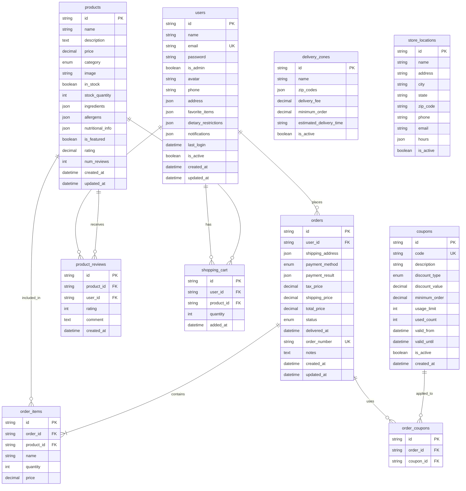

# Sugar Plum Bakery Database Diagram

## Database Relationships Explanation

### Core Entities

1. **Users**: Customer accounts with authentication and preferences
2. **Products**: Bakery items with pricing, inventory, and details
3. **Orders**: Customer purchases with shipping and payment info
4. **Order Items**: Individual products within an order

### Supporting Entities

5. **Product Reviews**: Customer feedback on products
6. **Shopping Cart**: Persistent cart storage for logged-in users
7. **Coupons**: Discount codes and promotions
8. **Order Coupons**: Junction table for coupon usage
9. **Delivery Zones**: Geographic delivery areas and fees
10. **Store Locations**: Physical bakery locations

### Key Relationships

- **Users → Orders**: One-to-many (customers place multiple orders)
- **Orders → Order Items**: One-to-many (orders contain multiple items)
- **Products → Order Items**: One-to-many (products appear in multiple orders)
- **Users → Product Reviews**: One-to-many (customers write multiple reviews)
- **Products → Product Reviews**: One-to-many (products receive multiple reviews)
- **Users → Shopping Cart**: One-to-many (customers have multiple cart items)
- **Products → Shopping Cart**: One-to-many (products can be in multiple carts)
- **Orders → Coupons**: Many-to-many (orders can use multiple coupons)

### Data Flow

1. **Registration/Login**: User creates account → stored in users table
2. **Browsing**: Products displayed from products table
3. **Cart Management**: Items added to shopping_cart table
4. **Checkout**: Order created in orders table, items moved to order_items
5. **Payment**: Payment details stored in orders.payment_result
6. **Fulfillment**: Order status updated, delivery tracking added
7. **Reviews**: Customers can review products they've purchased

### Indexing Strategy

- Primary keys on all tables
- Foreign key indexes for performance
- Unique constraints on email, order_number, coupon codes
- Full-text search index on product name/description
- Composite indexes for common query patterns

### Data Integrity

- Foreign key constraints ensure referential integrity
- Check constraints on numeric values (prices, quantities, ratings)
- Enum constraints on status fields and categories
- Unique constraints prevent duplicate data where appropriate